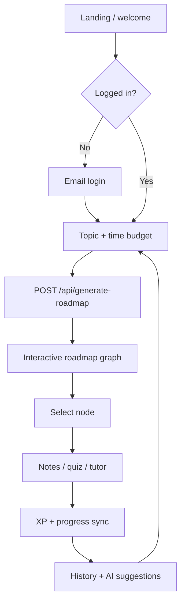
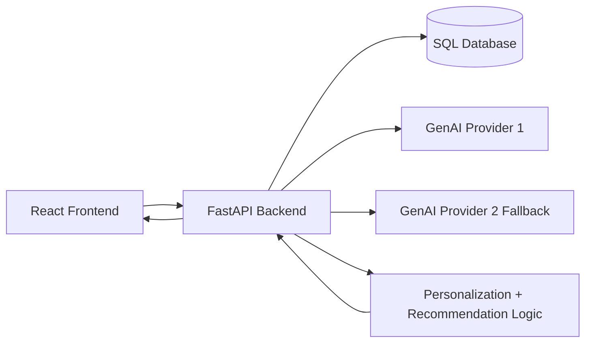
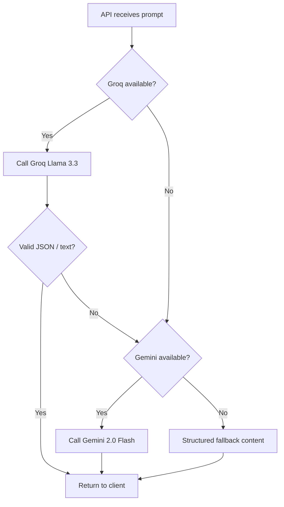
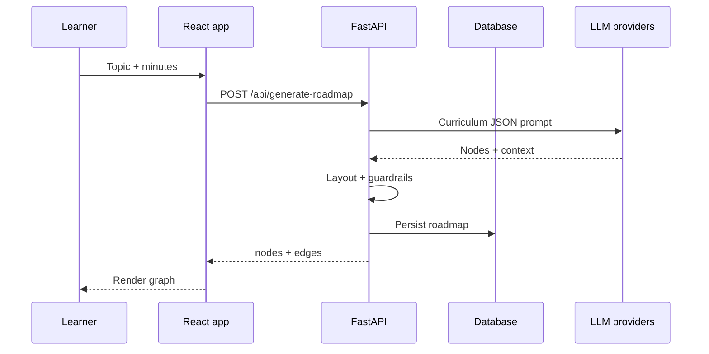

# 🔥 Vector Visionary
### *Learn Smarter, Not Harder - an AI-powered visual learning engine that turns any goal into a personalized mastery roadmap in seconds.*

 ## 🚀 Live Demo

- **Frontend (Vercel):** https://vectorvisionarymindmapgenerator.vercel.app
- **Backend API (Render):** https://devstakes-project.onrender.com
- **API Docs (Swagger):** https://devstakes-project.onrender.com/api/docs

> ⚠️ Backend is hosted on Render's free tier — it may take 30–50 seconds  
> to wake up on first request. Please wait before testing.

### 🎬 Demo video

**Full project walkthrough (YouTube):** [https://www.youtube.com/watch?v=nrUbXmgg0iE](https://www.youtube.com/watch?v=nrUbXmgg0iE)

---

## 🌍 Problem Statement

Traditional online learning is broken for motivated learners:

- Content is **fragmented across platforms** (docs, videos, repos, blogs) with no guided sequence.
- Most learners do not know **what to learn next**, causing decision fatigue and drop-off.
- Generic courses ignore personal constraints like **time available**, current skill level, and weak areas.
- Progress tracking is shallow, so users lose momentum and consistency.

**Why it matters:**  
In fast-moving tech domains, the ability to learn quickly and systematically is a competitive advantage. Learners need an intelligent system that provides structure, context, and motivation - not another content dump.

---

## 💡 Solution Overview

**Vector Visionary** is a full-stack AI learning platform that generates adaptive, node-based roadmaps for any topic and helps users execute them end-to-end.

- User enters a topic + available study time.
- System generates a personalized, dependency-aware roadmap graph.
- Each node unlocks deep AI-generated notes, quiz-based reinforcement, and practical resources.
- Progress is gamified with XP, levels, streaks, and history to build long-term learning discipline.

**What makes it unique:**

- Time-aware roadmap generation (15 min to 2+ hour plans)
- Dynamic graph architecture with unlock logic and progression
- Multi-provider GenAI pipeline (fast primary + resilient fallback)
- A polished, immersive frontend that feels product-grade, not prototype-grade

### User journey (flow)



### Problem vs solution (quick map)

| Pain point | What Vector Visionary does |
| :--- | :--- |
| No clear learning path | Time-aware, prerequisite-style roadmap graph |
| Passive reading | Quizzes, streaks, XP, and an AI tutor |
| Scattered resources | Curated links and structured deep-dive notes |
| No sense of progress | History, levels, and personalized next topics |

---

## 🧠 Key Features

### 🎨 Frontend (React)

- **Immersive landing + onboarding experience** with motion, particles, and micro-interactions to maximize first-impression impact.
- **Interactive roadmap graph UI** with node relationships, branching paths, and visual learning progression.
- **Smart dashboard flow** for login, topic input, time selection, history recall, and suggestion-driven generation.
- **Responsive and premium UX patterns** using modern component design, animations, and state-driven UI updates.
- **Gamified interaction loop** with visible XP progression, streak mechanics, and instant action feedback.

### ⚙️ Backend (APIs, DB, auth)

- **FastAPI-powered modular backend** with clean endpoint separation for auth, roadmap generation, notes, quiz, tutor chat, history, and suggestions.
- **User profile + progression persistence** (email-based auth, profile setup, XP and level sync).
- **Roadmap history engine** that lets users revisit previously generated learning paths.
- **Structured data storage** via SQLAlchemy + SQLite (extensible to production databases).
- **CORS-enabled service layer** ready for decoupled frontend deployment.

### 🤖 ML Features (models, predictions, personalization)

- **Personalized topic recommendations** generated from recent learning history.
- **Adaptive roadmap complexity** based on selected time window and topic scope.
- **Difficulty and reward shaping** (node difficulty, XP rewards, unlock progression) to optimize retention and motivation.
- **Learning-path personalization loop** using prior behavior signals (history + recent topics).

### ✨ GenAI Features (LLMs, chat, recommendations, automation)

- **AI roadmap generation** that returns structured, context-rich node content (outcomes, prerequisites, time estimates, resources).
- **AI deep-dive notes generator** producing concept breakdowns, mistakes, rules, examples, and next-step prompts.
- **AI quiz generator** with progressive MCQs for active recall and reinforcement.
- **AI tutor chat** for contextual explanation, examples, and guidance.
- **Resilient multi-model strategy** (primary provider + fallback provider) for reliability under rate limits.

---

## 🏗️ System Design / Architecture

High-level architecture is designed for **modularity, scalability, and hackathon-speed iteration**:

- **Frontend Layer (React + TypeScript + Vite):**
  - UI/UX, state orchestration, graph rendering, user actions
- **API Layer (FastAPI):**
  - Stateless HTTP endpoints for auth, AI generation, progress, history
- **Data Layer (SQLAlchemy + SQLite):**
  - Users, progression metrics, roadmap persistence
- **AI Orchestration Layer:**
  - Prompt pipelines for roadmap, notes, quiz, tutor, suggestions
  - Provider failover for robustness (Groq primary, Gemini fallback)



### GenAI routing (resilience)



### Request sequence (roadmap generation)



**Scalability mindset:**

- API-first architecture supports web/mobile clients.
- LLM calls are isolated behind service functions for easy provider swaps.
- DB abstraction supports migration from SQLite to Postgres without frontend changes.
- Feature modules (roadmap, notes, quiz, tutor) can scale independently.

---

## ⚡ Tech Stack

| Layer | Stack | Why it matters |
| :--- | :--- | :--- |
| **UI** | React 19, TypeScript, Vite | Fast dev, typed components, production builds |
| **Styling & motion** | Tailwind CSS, Framer Motion, GSAP | Polished UX without sacrificing iteration speed |
| **State & routing** | Zustand, React Router | Simple global state + clear navigation |
| **Visual graph** | `@xyflow/react`, Dagre | Node-based roadmaps that feel interactive, not static |
| **Backend** | FastAPI, Uvicorn | Async-friendly APIs with automatic OpenAPI docs |
| **Data** | SQLAlchemy, SQLite (dev) | Persistent users, roadmaps; easy Postgres migration |
| **GenAI** | Groq + Gemini | Speed + redundancy under rate limits |
| **Quality** | ESLint, Pydantic | Safer refactors and validated payloads |

---

## 🔌 API surface (high level)

| Endpoint | Method | Purpose |
| :--- | :---: | :--- |
| `/api/auth/login` | POST | Create or fetch user by email |
| `/api/user/setup` | POST | Profile display name + photo |
| `/api/user/progress` | POST | Sync XP and level |
| `/api/generate-roadmap` | POST | Build graph from topic + time budget |
| `/api/generate-notes` | POST | Structured reference notes for a node |
| `/api/generate-quiz` | POST | MCQ set for active recall |
| `/api/ai-tutor/chat` | POST | Contextual tutor replies |
| `/api/history/{email}` | GET | List saved roadmaps |
| `/api/suggestions` | POST | Next topics from recent history |

> Full interactive docs: [Swagger UI](https://devstakes-project.onrender.com/api/docs)

### Time budget → roadmap size

| Minutes selected | Nodes generated | Typical use |
| :---: | :---: | :--- |
| ≤ 20 | 4 | Quick review |
| 21–40 | 5 | Focused session |
| 41–60 | 6 | Standard learn block |
| 61–90 | 8 | Deep dive |
| > 90 | 10 | Full mastery pass |

---

## 🚀 How It Meets Judging Criteria

| Criterion | Weight | One-line proof |
| :--- | :---: | :--- |
| Core functionality | 30 | Login → generate graph → notes/quiz/tutor → persist history |
| UI/UX | 20 | Motion, graph UX, clear primary actions, responsive layout |
| Performance | 15 | Vite build, lean API payloads, scoped UI updates |
| Clean code | 15 | Separated API client, store, routes, and AI services |
| Git practices | 10 | Branch-per-feature workflow, reviewable PRs |
| Deployment | 5 | Env-based config, CORS-ready split deploy |

### ✅ Core Functionality (30 pts)

- Complete user journey is functional: login -> topic selection -> roadmap generation -> node exploration -> AI notes/quiz/chat -> progress sync -> history recall.
- End-to-end integration across frontend, backend, persistence, and AI services demonstrates real product viability.
- Fallback logic ensures the app still works when one model provider is constrained.

### 🎨 UI/UX (20 pts)

- Interface is intentionally crafted to feel like a premium product: animated hero, interactive cards, visual roadmap graph, elegant transitions.
- Clear user flow minimizes friction and cognitive load.
- Responsive component patterns and concise feedback loops improve usability under demo pressure.

### ⚡ Performance (15 pts)

- Vite-based build pipeline for fast dev and production builds.
- Frontend renders are optimized via modular state and scoped UI updates.
- Efficient API design with focused payloads keeps interactions snappy.
- Architecture supports additional optimizations like route-level lazy loading and CDN-backed static delivery.

### 🧼 Clean Code (15 pts)

- Strong separation of concerns: UI components, state store, API client, backend routes, DB models.
- Reusable component structure and typed models improve maintainability.
- Prompt generation and parsing are encapsulated for easier testing and iteration.
- Consistent conventions and modular files reduce onboarding time for collaborators.

### 🌿 Git Practices (10 pts)

- Team-friendly workflow with feature-based branches and incremental commits.
- Clear separation between frontend, backend, and AI integration workstreams.
- PR-ready modular commits enable easier review and conflict reduction.
- Hackathon-speed delivery balanced with traceable changes and collaborative integration.

### 🌐 Deployment (5 pts)

- Frontend and backend are **live and publicly accessible** — deployed on **Vercel** (frontend) and **Render** (backend) with zero manual setup required for judges.
- **Frontend (Vercel):** https://vectorvisionarymindmapgenerator.vercel.app/roadmap — production build served via global CDN for fast load times worldwide.
- **Backend (Render):** https://devstakes-project.onrender.com — live REST API with full **Swagger/OpenAPI docs** at `/api/docs` for transparent, explorable endpoints.
- CORS and API abstraction simplify multi-environment rollout.
- Environment-based config cleanly separates dev and production secrets.
- Architecture supports stable live demo links and continuous uptime on modern cloud platforms.

---

## 🛠️ Installation & Setup

### 1) Clone the repository
```bash
git clone <your-repo-url>
cd DevStakes_Project
```

### 2) Frontend setup
```bash
cd frontend
npm install
```

Create `frontend/.env` (optional if API URL is hardcoded):
```env
VITE_API_BASE_URL=http://127.0.0.1:8000/api
```

### 3) Backend setup
```bash
cd ../backend
python -m venv venv
# Windows
venv\Scripts\activate
# macOS/Linux
# source venv/bin/activate

pip install -r requirements.txt
```

Create `backend/.env`:
```env
GROQ_API_KEY=your_groq_api_key
GEMINI_API_KEY=your_gemini_api_key
```

### 4) Run backend
```bash
uvicorn main:app --reload
```

### 5) Run frontend (new terminal)
```bash
cd frontend
npm run dev
```

### 6) Open app
- Frontend: `http://localhost:5173`
- Backend docs: `http://127.0.0.1:8000/docs`

---

## 🌐 Deployment

### Frontend (Vercel / Netlify)

- Import `frontend` as project root.
- Build command: `npm run build`
- Output directory: `dist`
- Add env:
  - `VITE_API_BASE_URL=https://<your-backend-domain>/api`
- Deploy and verify all routes + API calls.

### Backend (Render / Railway / Fly.io)

- Deploy `backend` as a Python web service.
- Start command:
  ```bash
  uvicorn main:app --host 0.0.0.0 --port $PORT
  ```
- Set environment variables:
  - `GROQ_API_KEY`
  - `GEMINI_API_KEY`
- Configure persistent database (Postgres recommended for production).
- Update CORS origins with your deployed frontend URL.

---

## 🔮 Future Scope

- Real-time **learning analytics dashboard** (completion probability, weak-concept heatmaps).
- **Spaced repetition engine** with adaptive revision scheduling.
- **Collaborative learning rooms** and mentor mode.
- **Interview-mode roadmaps** for role-specific preparation (SDE, ML, Product, etc.).
- **Voice Based AI tutor** and multimodal note generation.
- Enterprise-ready LMS integrations and cohort-level progress tracking.

---

### 🏁 Final Pitch

**Vector Visionary is not just a demo - it is a complete, intelligent learning product** that combines modern frontend engineering, robust backend design, practical AI integration, and a clear user-value loop.  
Built in 84 hours, it showcases execution speed, technical depth, and product thinking.
